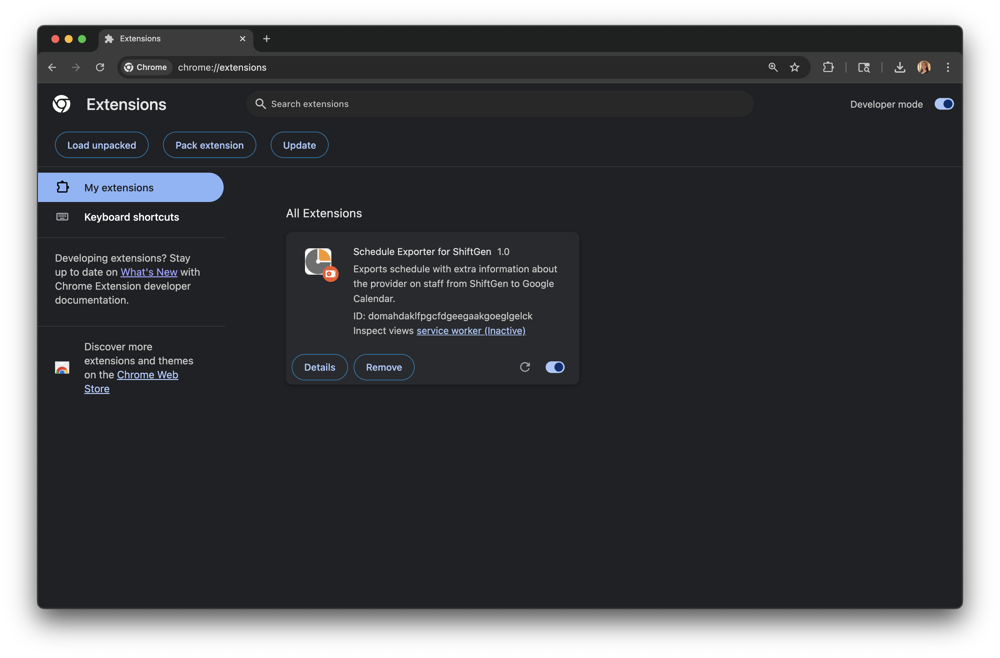

# Schedule Exporter for ShiftGen
Chrome extension to assist medical staff in exporting schedule with extra information about the provider on staff from ShiftGen to Google Calendar.

## Installation
Since this Chrome extension is still in development, users must install this extension through the extension developer mode by cloning the repository and loading the unpacked extension in [chrome://extensions/](chrome://extensions/). Current implementation with the Google Calendar API is currently limited to test users.



## Usage

To use this extension, first open the extension's popup and configure the settings.

* Target Month: The month of the current year to be processed
* Calendar ID: The Google Calendar ID where the processed shifts will be exported to. To find this value, navigate to the settings page of your Google Calendar, navigate to the "Integrate calendar" subsection, and copy "Calendar ID" value into the extension popup.

<div style="text-align:center">
  
</div>

After the settings have been configured, login to [https://shiftgen.com](https://shiftgen.com) and click "Scrape ShiftGen Schedule" to gather all shift data and provider information. This process will open new tabs in your browser as the extension navigates to different pages within ShiftGen. When you get a popup saying "Done processing shifts. Navigate to ShiftGen Popup to export to Google Calendar!" the processing is complete and you may close any open ShiftGen tabs. 

<!-- TODO: add picture of popup -->

Open the extension popup to examine the processed shift data. To export the data to Google Calendar, simply click the "Export to Google Calendar" button.

<div style="text-align:center">
  
</div>

## Known Bugs

* On slow computers, shift processing will fail because web scraping takes too long. A better messaging architecture to indicate user/provider schedule scraping complete should be implemented to avoid moving onto the next schedule before data has been saved to the local storage. One workaround is to close all Chrome tabs other than https://shiftgen.com when processing shifts.
* ShiftGen recently updated their UI in May 2025 which deprecates this codebase. A refactor is required to work with their new page structure and navigation.

<!-- ## Automated Scraping Process
1. Click "Scrape" button in popup, sets scraping flag to true
2. popup opens a new tab at [https://www.shiftgen.com/member/schedule](https://www.shiftgen.com/member/schedule), and saves TAB_ID
3. Submit POST request to change site to USER
```html
<form action="/member/change_selected_site" id="site_change_form" method="post">
   <select id="site_id" name="site_id"><option value="83">CHOC Scribe</option>
   <option value="84">St Joseph/CHOC MLP</option>
   <option value="80" selected="selected">St Joseph/CHOC Physician</option></select>
</form>
```
1. Page redirects to [https://www.shiftgen.com/member/multi_site_schedule](https://www.shiftgen.com/member/multi_site_schedule)
2. In content scripts for [https://www.shiftgen.com/member/multi_site_schedule](https://www.shiftgen.com/member/multi_site_schedule), check scraping flag and if true redirect to [https://www.shiftgen.com/member/schedule](https://www.shiftgen.com/member/schedule)
3. Find table with thead containing the selected Month, set "My Schedule Only" input to true, and click "Create Print Version"
```html
<div class="col-md-6">
  <form action="/member/schedule" method="post">
    <input id="_id" name="[id]" type="hidden" value="14544">
    <table class="schedule" cellpadding="0">
      <thead>
        <tr>
          <th colspan="2" class="text-left">
            <h2><a href="/member/schedule/14544">March 2025 - CHOC</a></h2>
          </th>
        </tr>
      </thead>
      <tbody>
        <tr>
          <td>
            <label for="start_date_14544" class="dimmed">Starting</label>
            <input class="input-lg col-md-11" id="start_date_14544" name="start_date_14544" type="text" value="March 01, 2025"> 
          </td>
          <td>
            <label for="end_date_14544" class="dimmed">Ending</label>
            <input class="input-lg col-md-11" id="end_date_14544" name="end_date_14544" type="text" value="March 31, 2025"> 
          </td>
        </tr>
        <tr>
          <td width="230">
            <p class="dimmed">Shifts to Print</p>
            <ul class="unstyled">
              <li>
                <label><input type="checkbox" name="print_only_my_schedule"> My Schedule Only</label>
              </li>
              <li>
                <label><input type="checkbox" name="shift_groups[]" value="214" checked=""> Scribe</label>
              </li>
            </ul>
          </td>
          <td>
            <p class="dimmed">Edit</p>
            <ul>
              <li><a href="/member/record_overtime_for_schedule?schedule_id=14544&amp;worker_id=18642">Modify Hours Worked</a></li>
            </ul>
          </td>
        </tr>
        <tr>
          <td class="text-right" colspan="2">
            <br>
            <input class="btn" id="schedule_submit" name="commit" type="submit" value="Create Print Version">
          </td>
        </tr>
      </tbody>
    </table>
  </form>
</div>
```

1. Page redirects to USER print view
2. Scrape page, then redirect to [https://www.shiftgen.com/member/schedule](https://www.shiftgen.com/member/schedule) -->